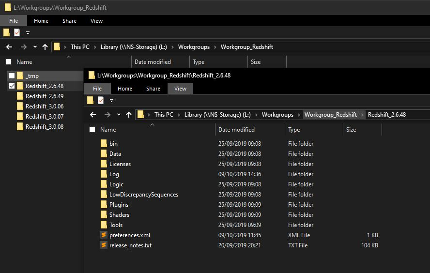

# ns_Startup v0.1.43 for Houdini

Add install dependencies button.
(You need an _install.txt file to specifiec sources. For example a path to ..\install.exe)

# ns_Startup v0.1.41 for Houdini

Add scalable UI  
Add a little package Manager.

# ns_Startup v0.1.39 for Houdini

Initial release with houdini`s packages support. Linux is not supported yet.
In the settings tab you can decide the starting option. If packaging is enabled the script will create the package after you press the "Open Houdini" button, and set the HOUDINI_PACKAGE_DIR var before startup.
The location is up to you, locally or globally.
Local is the script location.
Global the specified path in the settings tab under "Global Presets"

# ns_Startup v0.1.30 for Houdini

(Click to start Vimeo teaser)

This python script was created to starting Houdini easily with the right 
workgroups/renderers etc. without changing always the local .nv file.

Done with Python 2.7 & PyQt4. Including a WOL functionality for my FreeNAS fileserver and a preset/job system. 
The preset system can be used globally - and pushed, to make them accessible to other clients/workstations. 
I implemented a preset "Check" to make sure the workgroups/renderers are physically existing. 
If not, you will get a warning, so you can reinstall them.

And a fun gimmick, a little text chat client.

Chat Server: https://gitlab.com/e_noni/ns_startup_server

(Windows only right now, i still working on a linux version with json packages)
- you need a proper Python 2.7 installation
- activate the virtualenv ns_Startup\venv\Scripts\activate.bat
- run the ns_Startup\run_ns_Startup.bat
- check the init paths in the ns_Startup.py

#
**Some documentation stuff:**

This script search and parse for specific folder patterns (especially "_" & "-" chars). So make sure you set the right paths in the .py file, or just use the same current path structure. (check the init paths in the ns_Startup.py)

#
**Presets:**

Default: sets a configuration which will loaded when the script will start. No saved preset necessary.

Push: pushes a preset to a global folder, so other user have access to it. (set the the destination folder in the settings tab).

Delete/Save: delete/create a preset. You can choose a custom preset icon. (click on the default icon)

Check: checks if all selected sources physically exist. (sometimes useful if a older preset needs a deleted source, in this chase it blinks red) 

#
**Selection Tables and folder structures:**

* Houdini:

* Renderer::Redshift: (zero-installs)

* Renderer::Arnold: (zero-installs)

* Renderer::Octane:

* Renderer::V-Ray:

#
**Settings:**

* (1):

Here you can set a additional script, for instance a render script, which also loaded with a new Houdini session.

* (2):

Sets the Arnold OS environment variable to a arnold license server. 

* (3):

You can start other computers with WOL. Can automatically start when the script is launching.

* (4):

"Global Presets" defines a folder where you can push presets to and are accessible to other user.

* (5):

Some chat options. Most is obvious.

* (6):

In case you dont have floating Redshift license(s) you can also use the locked license to use the zero installs. The "Local Redshift License" options sets OS environments to your local .lic files.
But you have to install once redshift locally first and do a single render to generate the second .lic file locally.

* (7):

Keeps the .bat file which will executed. (You can also see the content of the .bat file at the log tab)

* Save Config button:

Stores values to make it default for every startup.

* "up-to-date" button:

Checks if a newer script version exist and copy it to your local script folder. (check the init paths in the ns_Startup.py)

